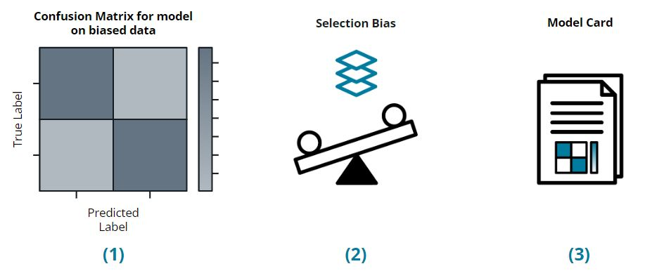

# IDOOU Budget Predictor — Ethical AI Project

This project was part of the Udacity Ethical AI course — building, evaluating, and mitigating bias in a budget prediction model for the IDOOU activity recommender app.

## Introduction

IDOOU is a mobile app that recommends activities to users in a given area, like visiting a movie theater, a park, sightseeing, hiking, or a library. It personalises recommendations using features such as gender, age, and education level.

The app's objective is to remove users from having to handle the nitty-gritty details of finding the right activity — determining the appropriate budget, ensuring the weather is perfect, and the location is not closed — so users can focus on having fun.

## Problem Statement

Do users with higher education credentials beyond high school have a budget >= $300, compared to app users who graduated from high school?

This project designs IDOOU's budget predictor model, evaluates its fairness, and applies bias mitigation strategies.

**Key Points:**
- Training data from a user experience study of ~300,000 participants
- Users may choose not to provide demographic information — the training data reflects this
- Fairness framework definitions are not necessarily focusing on socioeconomic privilege

---

## Project Steps



1. **Data Pre-processing** — NaN analysis, binning, one-hot encoding, bias evaluation
2. **ML Model Investigation** — Gaussian Naive Bayes and Logistic Regression with fairness metrics
3. **Model Card Articulation** — Intended use, factors, metrics, training/eval data
4. **Interpretability** — Permutation importance before and after mitigation
5. **Bias Mitigation** — Reweighing (pre-processing) + Reject Option Classification (post-processing)
6. **Ethical Implications** — Human-in-the-loop, potential harms, caveats, business consequences

---

## Key Findings

- Education level and age are near-perfect predictors of budget (Cramér's V: 0.98 and 0.97)
- Before mitigation: Equal Opportunity Difference = -1.0 (HS Grads with high budget were never correctly predicted)
- After Reweighing: Equal Opportunity Difference = 0.0, Balanced Accuracy = 98.37%

---

## Project Structure

```
submission/
├── AI Ethics Project -- STARTER.ipynb   # Main notebook
└── model_card.html                       # Generated model card
Theory/
├── 1_DataPreporcessingAndEval.md         # Step 1 — data cleaning, bias evaluation, Cramér's V
├── 2_InvestigateMLModel.md              # Step 2 — GNB vs LR, fairness metrics, accuracy paradox
├── 3_InterpretabilityAndMitigation.md   # Steps 4+5 — permutation importance, Reweighing
└── 4_EthicalImplications.md             # Step 6 — harms, HITL, business consequences
tables_plots/
├── nan_analysis.png                      # NaN distribution across demographic groups
├── cramers_v_heatmap.png                 # Cramér's V association matrix
├── pipeline_diagram.png                  # End-to-end pipeline diagram
├── rw_confusion_matrix.png               # Confusion matrix (post-mitigation)
├── rw_feature_importance.png             # Permutation importance (post-mitigation)
├── cohort_analysis.png                   # Accuracy cohort by education level
└── fairness_cohort_analysis.png          # TPR/FPR cohort by education level
data/
└── ai_ethics_project_data.csv            # Synthetic dataset (300K users)
steps.jpg
requirements.txt
```

---

## Setup

```bash
python -m venv .venv
source .venv/bin/activate
pip install -r requirements.txt
```

---

## Helpful Resources
- [AIF360 Toolkit Documentation](https://aif360.readthedocs.io/en/stable/)
- [Model Cards for Model Reporting (Paper)](https://arxiv.org/pdf/1810.03993.pdf)

---

## Tools Used
- [IBM AIF360](https://github.com/Trusted-AI/AIF360) — Fairness metrics and bias mitigation
- scikit-learn — Logistic Regression, Gaussian Naive Bayes, Permutation Importance
- pandas, seaborn, matplotlib — Data analysis and visualisation
