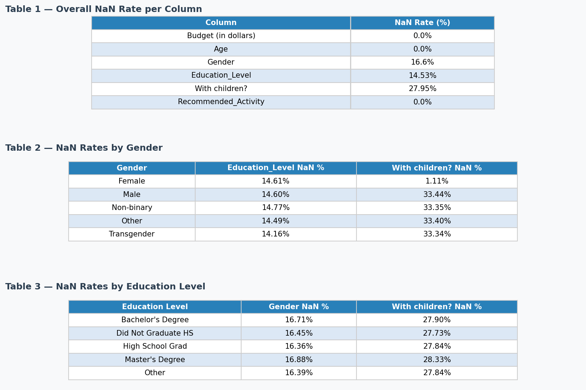
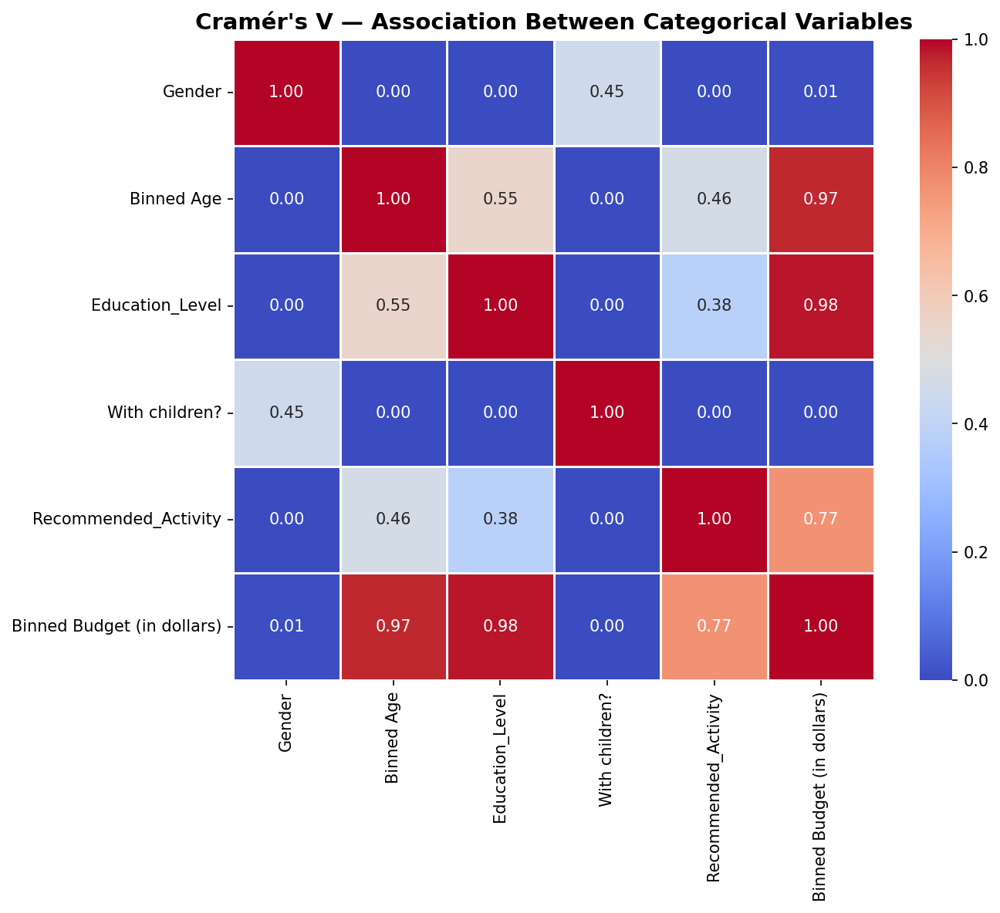

> **Note:** This is a study guide covering concept explanations, decision reasoning, step-by-step walkthrough, and key findings for the IDOOU Budget Predictor project.

# Step 1: Data Pre-processing and Evaluation

> **What this step does:** Cleans the dataset, engineers features, checks for pre-existing bias in the raw data, and prepares the data for model training.

---

## Context: The Problem We're Solving

**Problem statement:**
> "IDOOU's creators would like to identify if users with bachelor's and master's degrees are a privileged group in terms of budget. In other words, do users with higher education credentials beyond high school have a budget ≥ $300 compared to users of the app who graduated from high school?"

A few things to unpack here:

**"Unprivileged" is a technical term, not a value judgement.** The unprivileged group is the group that a model is likely to systematically disadvantage in its predictions. If the model consistently predicts HS graduates as low-budget — even when they're not — then HS graduates are the unprivileged group.

**The problem statement is really asking two questions:**
1. Is education level a predictor of budget? (Does this pattern exist in the data?)
2. Is that prediction fair? (Does the model rigidly apply the pattern even to individuals who are exceptions?)

We allow the model to learn that education correlates with budget. What we don't want is for the model to *never* predict a HS grad as high-budget, because then it stops making statistical inferences and starts discriminating against individuals for belonging to a group.

> **The core ethical point:** When a model encodes a statistical association about a group and applies it rigidly to every individual in that group, it stops being statistics and starts being discrimination. The individual pays the price for their group's average.

---

## Project Walkthrough

### 1. Inspect the Raw Data

The dataset has NaN values scattered across columns. Before deciding how to handle them, we first check *how* they're distributed — because not all missing data is the same.

---

#### Concept Note: Missing Data Mechanisms

There are three patterns of missingness, each requiring a different response:

| Type | What it means | Example | How to handle |
|------|--------------|---------|---------------|
| **MCAR** — Missing Completely At Random | Missingness is independent of all variables, observed or not. | A sensor randomly fails. | Safe to drop rows or do simple imputation. |
| **MAR** — Missing At Random | Missingness depends on *observed* variables, not on the missing value itself. | Income is missing more often for younger people, but among people of the same age, missingness is random. | Regression imputation, multiple imputation, or ML-based imputation. |
| **NMAR** — Not Missing At Random | Missingness depends on the missing value itself. | High-income individuals refuse to disclose their income. | Turn missingness into a feature, or model it explicitly. |

---

**What we found:** NaN rates were roughly even across all gender and education groups — no demographic was disproportionately missing data. This is consistent with MCAR.

**Why we dropped NaNs:** The MCAR pattern and the large dataset size mean dropping rows doesn't remove a biased slice of the data and doesn't meaningfully reduce statistical power.

One nuance: female users showed a slightly lower NaN rate on the "With children?" column. This is worth flagging because MCAR means missingness is *completely* random — no variable in the dataset should be able to predict whether a value is missing. If female and male users had the same NaN rate on "With children?", that's consistent with MCAR. But when the rate differs by gender, it means knowing a user's gender lets you predict whether their "With children?" value is missing. That dependence on an observed variable (Gender) is what makes this MAR — male users appear to be less forthcoming about reporting parental status, so the missingness is structured, not random noise.

Normally, MAR means dropping rows removes a non-random slice of the data (here, skewing toward male users on that column). In this project it doesn't matter in practice: later, we'll see that "With children?" has a Cramér's V of 0.00 with Budget, meaning it carries no predictive signal at all, so any skew introduced by dropping has no meaningful effect on the model.

---

### 2. Bin Age and Budget into Categories

The project requires a **classification task** (is a user's budget ≥$300 or <$300?), so continuous numerical features need to be bucketed.

- **Age** → bins: 18–24, 25–44, 45–65, 66–92
- **Budget** → bins: `<$300` (label 0) and `≥$300` (label 1)

**Why these age bins:** They're conventional demographic groupings (young adult, working-age, pre-retirement, retirement), which makes downstream fairness analysis more interpretable.

**Why this budget cutoff:** It's given by the problem statement. In a real project, this threshold should always be justified by business context — not chosen to make the model look good.

---

### 3. One-Hot Encode Categorical Variables

ML models can't natively read category names, so categorical columns are converted to binary dummy columns (one column per category value).

**Why `drop_first=False` (keep all categories):** The common practice of dropping one category to avoid the dummy variable trap only matters for linear algebra — when we're doing fairness analysis, dropping a category creates a hidden *reference group* that the fairness toolkit (AIF360) can't see or evaluate. Keeping all columns makes every group explicit and auditable.

---

### 4. Dataset Representativeness Analysis

Before training any model, we check whether certain groups are over- or under-represented in the data. An imbalanced training set can cause a model to perform well on the majority group and poorly on minorities — not because of anything the model does wrong, but because it simply had fewer examples to learn from.

**What we found:**

- **Age is heavily skewed** — 18–24 year olds make up ~49% of the dataset. Groups 45–65 and 66–92 are significantly underrepresented.
- **Education is imbalanced** — Post-HS users (Bachelor's + Master's) represent ~49% of the dataset; High School Grads represent only ~17%. The privileged group has nearly 3× the representation of the comparison group.

This is a pre-model warning sign: even before training, the data is weighted toward the group we'll later identify as privileged.

---

### 5. Multicollinearity Check — Cramér's V

We check how strongly the categorical variables are associated with each other *before* any model is trained. This tells us which features carry real predictive signal and which might be encoding bias.

---

#### Concept Note: Cramér's V

Cramér's V measures the strength of association between two categorical variables. It answers: *"How strongly are these two categories related?"* regardless of table size or number of categories.

**Formula:**

$$V = \sqrt{\frac{\chi^2 / n}{\min(k-1,\ r-1)}}$$

Where:
- $\chi^2$ = chi-squared statistic from a contingency table of the two variables
- $n$ = total number of observations
- $k$ = number of columns in the contingency table (categories of variable 2)
- $r$ = number of rows (categories of variable 1)
- $\min(k-1, r-1)$ = normalisation factor that keeps V in [0, 1] regardless of table dimensions

The chi-squared statistic measures whether two categorical variables are independent. Cramér's V normalises it so you can compare associations across tables of different sizes.

**Bias correction:** In small samples, the chi-squared statistic is naturally inflated — even truly independent variables produce a non-zero χ² just from sampling noise. Raw Cramér's V inherits this and overestimates the true association. The correction fixes this in two steps:

1. **Subtract the expected noise from φ²:** Under the null hypothesis (variables are independent), the expected value of φ² = χ²/n isn't zero — it's $\frac{(k-1)(r-1)}{n-1}$. The corrected version subtracts this noise floor: $\tilde{\phi}^2 = \max\left(0,\ \frac{\chi^2}{n} - \frac{(k-1)(r-1)}{n-1}\right)$

2. **Shrink r and k:** The normalisation denominator was also calibrated for large samples, so r and k are adjusted downward by a sample-size-dependent factor before computing the final V.

As n grows large, both corrections vanish and the result converges to raw Cramér's V — so on a large dataset like this one, the difference is negligible.

**Key findings:**

| Variable pair | Cramér's V | What it means |
|---|---|---|
| Education Level ↔ Budget | **0.98** | Near-perfect — education level almost completely determines budget category |
| Age ↔ Budget | **0.97** | Near-perfect — driven by the fact that 100% of 18–24 year olds fall in the <$300 bucket |
| Age ↔ Education Level | **0.55** | Moderate — older users tend to have higher education, creating overlapping signals |
| Gender ↔ Budget | **0.01** | Negligible — gender is essentially irrelevant to budget prediction |
| With children? ↔ Budget | **0.00** | No association — parental status has no bearing on budget |

**An Association of 0.98 between Education and Budget is a red flag.** It means the model will almost perfectly learn to use education level as a budget predictor. Statistically that's fine — but ethically it means any bias in how education maps to budget in the training data will be baked directly into model predictions with near-zero error. Every exception — an HS grad with a high budget — is likely to be overridden by the dominant pattern.

**Should Education and Age be removed entirely?** No — dropping them leaves the model with almost no signal to learn from and accuracy collapses. Instead, we note the risk here and address it in Step 5 using bias mitigation (reweighting).

---

### 6. Narrow the Scope

The problem statement compares two specific groups: Post-HS degree holders (Bachelor's + Master's) vs. High School Graduates. Users who "Did Not Graduate HS" or reported "Other" education levels are outside the scope of this comparison and are dropped.

Similarly, columns for those categories and the `With children?` column (which has no association with budget, per Cramér's V) are dropped to reduce noise in the feature space.

---

### 7. Fairness Evaluation on Raw Data

Before any model is trained, we use IBM AIF360 to measure fairness metrics directly on the dataset. This establishes a baseline: how biased is the *data itself*?

---

#### Concept Note: Statistical Parity Difference and Disparate Impact

Both metrics compare the rate at which the privileged and unprivileged groups receive the positive outcome (budget ≥$300).

**Statistical Parity Difference (SPD):**

$$\text{SPD} = P(\hat{Y}=1 \mid \text{unprivileged}) - P(\hat{Y}=1 \mid \text{privileged})$$

- **Fair range:** −0.1 to +0.1
- Negative value → the unprivileged group receives the positive outcome less often
- Zero → both groups receive positive outcomes at equal rates

**Disparate Impact (DI):**

$$\text{DI} = \frac{P(\hat{Y}=1 \mid \text{unprivileged})}{P(\hat{Y}=1 \mid \text{privileged})}$$

- **Fair threshold:** ≥ 0.8 (the "80% rule" from employment discrimination law)
- A DI of 0.8 means the unprivileged group receives the positive outcome at least 80% as often as the privileged group
- Values below 0.8 indicate disparate impact — the privileged group benefits significantly more

When applied to the raw dataset (not a model), these metrics tell us whether the underlying data itself encodes a disparity — independent of any model choices.

---

**Pre-model fairness baseline on raw data:**

| Metric | Value | Fair range | Status |
|--------|-------|------------|--------|
| Statistical Parity Difference | **−0.984** | −0.1 to +0.1 | Far outside |
| Disparate Impact | **0.009** | ≥ 0.8 | Far outside |

These numbers say the same thing the Cramér's V already suggested: the dataset is extremely imbalanced. HS graduates receive the ≥$300 budget outcome at roughly 1% the rate of post-HS users. Any model trained on this data without intervention will inherit this disparity.

---

### 8. Train / Validation / Test Split

The data is split 50% / 30% / 20%:
- **Train (50%)** — what the model learns from
- **Validation (30%)** — used to tune the model (threshold selection, hyperparameters)
- **Test (20%)** — held out completely until final evaluation; the only honest measure of real-world performance

**Why not cross-validation?** Cross-validation could have been used as well. It would give more robust estimates on a small dataset. However, the dataset is large enough that a single split produces stable, reliable estimates — and it's simpler to apply AIF360 fairness metrics consistently on a fixed test set.

---

## Key Findings

| Finding | Value / Observation |
|---------|---------------------|
| Missing data pattern | MCAR-like — NaNs evenly distributed across groups → safe to drop |
| Dataset age distribution | 18–24 year olds: ~49% of data — heavy skew toward younger users |
| Dataset education distribution | Post-HS: ~49%, HS Grad: ~17% — 3× imbalance in privileged group representation |
| Education ↔ Budget association | Cramér's V = 0.98 — near-perfect, model will learn this almost deterministically |
| Raw data SPD | −0.984 — extreme disparity in the data before any model is trained |
| Raw data Disparate Impact | 0.009 — HS grads receive ≥$300 outcome at ~1% the rate of post-HS users |

---

## Ethical Flag

The data itself, before any model is involved, encodes a near-perfect disparity between education groups. This isn't a modelling problem yet — it's a data problem. The dataset reflects a world where HS graduates rarely appear in the ≥$300 budget category, and the model will learn this pattern with very high confidence.

Step 2 shows exactly what happens when we train a model on this data without any intervention: the model achieves high accuracy while being deeply unfair to HS graduate users.
