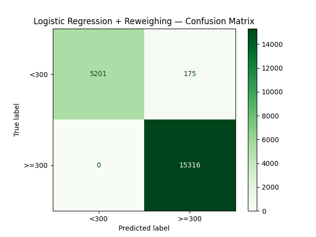
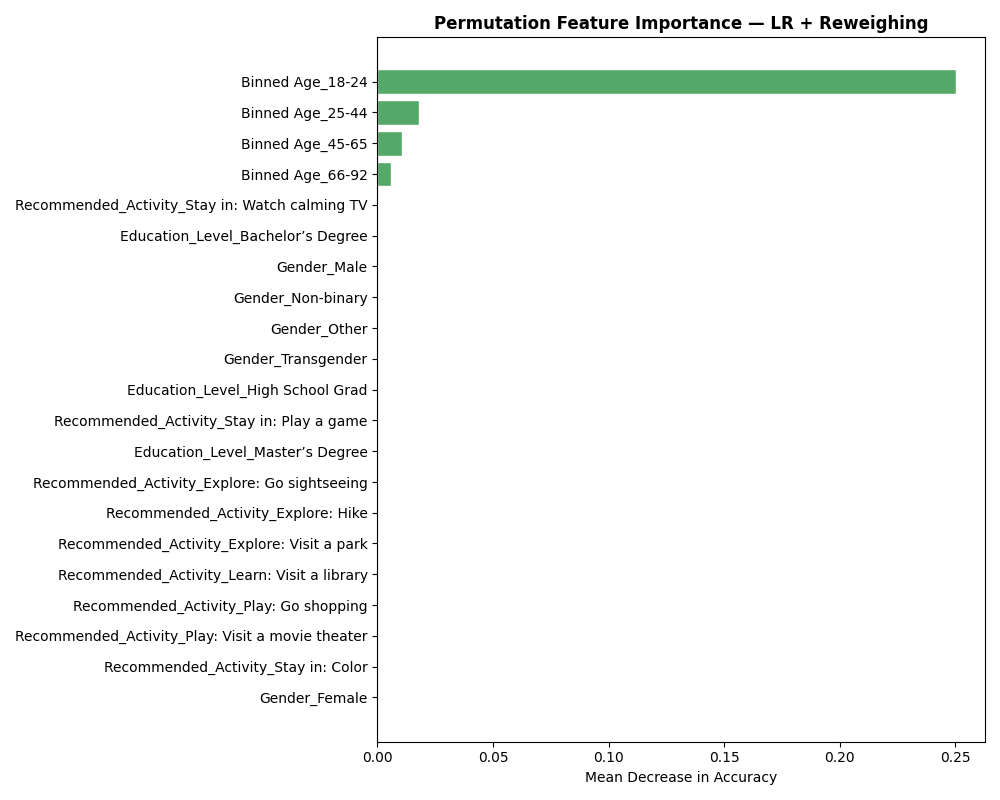
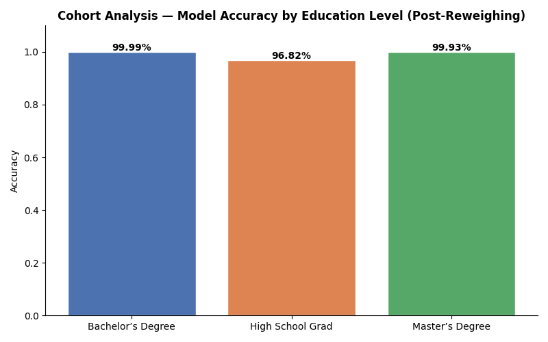
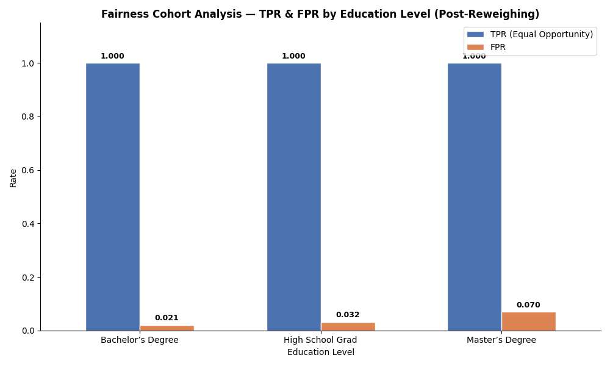

> **Note:** This is a study guide covering concept explanations, decision reasoning, step-by-step walkthrough, and key findings for the IDOOU Budget Predictor project.

# Step 4 + 5: Interpretability and Bias Mitigation

> **What these steps do:** First, open the black box — understand *why* the model is biased by examining which features drive its predictions. Then apply a mitigation strategy to make the model fairer, and verify that fairness improved without destroying accuracy.

---

## Context: Why Interpretability Comes Before Mitigation

You can't fix what you don't understand. Step 2 showed that the model is deeply unfair to HS grads. But fairness metrics alone don't tell you *why* — they just measure the outcome. Interpretability lets you trace the bias back to its source in the model's decision-making, which then informs which mitigation strategy makes sense.

---

## Part 1: Interpretability

### What's Driving the Model's Predictions?

---

#### Concept Note: Permutation Importance

Permutation importance is a model-agnostic way to measure how much each feature contributes to predictions. The idea is simple: if a feature is important, randomly shuffling its values across rows should hurt model performance — because the model can no longer use that signal.

**How it works:**
1. Record baseline model accuracy on the test set
2. For each feature, randomly shuffle its values (breaking any real relationship with the target)
3. Measure how much accuracy drops
4. The drop is the feature's importance — a large drop means the model depended heavily on that feature

**Why permutation importance over built-in feature coefficients?**
LR has coefficients that indicate each feature's weight. But coefficients reflect the model's internal weights on the training data. Permutation importance is measured on the *test set* — it reflects actual predictive contribution, not just what the model learned to weight. It's also directly comparable across features regardless of their scale.

**Dataset used:** The test set (`orig_test`), with true labels as the target. This measures how much shuffling each feature hurts accuracy against ground truth — the cleanest signal for real-world feature dependence.

---

**Pre-mitigation findings (LR on the biased dataset):**

- **Binned Age_18-24 is overwhelmingly the dominant feature** — importance ~0.07, dwarfing everything else. The model essentially learned one rule: if a user is 18–24, predict <$300. This is statistically defensible because 100% of 18–24 year olds in the dataset fall in the <$300 bucket.
- **Education level features rank 2nd, 3rd, 4th** (HS Grad > Master's > Bachelor's), confirming education is the second strongest driver.
- **Gender and recommended activity features show near-zero importance** — the model barely uses them.

**The age-education confound:** Age_18-24 and High School Grad are highly correlated in this dataset (Cramér's V = 0.55 from Step 1). Most 18–24 year olds are also HS grads, so the model uses Age_18-24 as a proxy for education level — and since it has stronger signal, it dominates. The result is that HS grads of all ages get pulled into the same prediction as 18–24 year olds: low budget, always.

This is the core bias mechanism: the model conflates *being young* with *being an HS grad* with *having a low budget*, and applies that pattern rigidly to every HS grad regardless of age or individual circumstances.

---

## Part 2: Bias Mitigation

### Choosing a Strategy

Two mitigation approaches are applied and compared:

1. **Reweighing** (pre-processing) — adjusts sample weights before training so the model sees a more balanced view of the data
2. **Reweighing + Reject Option Classification** (pre + post-processing) — adds a post-processing step on top of Reweighing that flips borderline predictions in favour of the unprivileged group

---

#### Concept Note: Reweighing

Reweighing is a pre-processing bias mitigation technique. It doesn't change the data or the model — it assigns higher **sample weights** to underrepresented group-outcome combinations so the model treats them as more important during training.

**The intuition:** In this dataset, HS grads with high budgets are rare — both because the group is small (~17% of data) and because few of them appear in the ≥$300 class. When the model trains, it sees very few of these examples, so it learns to ignore them. Reweighing says: "these rare examples matter more — treat each one as if it were several examples."

**How weights are calculated:** AIF360 computes weights based on the ratio of expected to observed frequency for each group-outcome combination:

$$w(x_i) = \frac{P(\text{group}) \cdot P(\text{outcome})}{P(\text{group} \cap \text{outcome})}$$

- Combinations that are underrepresented relative to what independence would predict get weights > 1
- Overrepresented combinations get weights < 1

The weights are passed directly to the `LogisticRegression.fit()` call via the `sample_weight` parameter — no changes to the algorithm itself, just how much each row's error counts in the loss function.

**Why pre-processing over in-processing or post-processing?** Pre-processing is the most transparent option — the intervention happens before the model touches the data, making it easy to audit and explain. It also doesn't constrain the model architecture, so LR can be used as-is.

---

#### Concept Note: Reject Option Classification (post-processing)

Reject Option Classification (ROC) is applied *after* a model makes predictions. It identifies predictions that fall near the decision boundary — cases the model is uncertain about — and flips those borderline predictions in favour of the unprivileged group.

**The logic:** A model is most uncertain near the threshold (e.g., a predicted probability of 0.35 when the threshold is 0.31). For uncertain cases, defaulting to the more privileged outcome is an implicit bias. ROC says: when the model is unsure, give the benefit of the doubt to the unprivileged group.

**In this project:** ROC is fitted on the validation set to learn the optimal "rejection zone" width — the range of probabilities around the threshold within which predictions get flipped. This approach is chosen to complement Reweighing when it alone isn't sufficient.

---

### Results After Reweighing

**Post-mitigation accuracy:** 99.15% — down from 99.72%, but still very strong. The small drop is the cost of fairness: the model is now occasionally overriding high-confidence-but-discriminatory predictions.

**Before vs. after fairness metrics:**

| Metric | Before Reweighing | After Reweighing | Fair range | Status after |
|--------|------------------|-----------------|------------|--------------|
| Balanced Accuracy | 99.78% | 98.37% | — | Strong ✓ |
| Statistical Parity Difference | −0.9927 | −0.9512 | −0.1 to +0.1 | Still outside |
| Disparate Impact | 0.000 | 0.0418 | ≥ 0.8 | Still outside |
| Average Odds Difference | −0.5252 | **−0.0091** | −0.1 to +0.1 | **Within range ✓** |
| Equal Opportunity Difference | −1.0000 | **0.0000** | −0.1 to +0.1 | **Perfect ✓** |
| Theil Index | 0.0026 | **0.0032** | < 0.25 | **Within range ✓** |

Three metrics (AOD, EOD, Theil Index) are now within fair range, satisfying the project requirement of at least two.

---

#### Concept Note: Theil Index

The Theil Index is borrowed from economics, where it measures income inequality. Applied to model predictions, it measures how unevenly distributed the "benefit" of positive predictions is across the population.

- **Range:** 0 (perfectly equal distribution) to ln(n) (maximum inequality)
- **Practical threshold:** values below ~0.25 are generally considered acceptable
- Unlike SPD and DI, Theil Index looks at the full distribution of predictions — not just the gap between two groups — making it sensitive to within-group inequality as well

In this project, Theil was already low before mitigation (0.0026) and remained low after (0.0032). This tells us the overall distribution of predictions was never wildly unequal — the problem was specifically in the *conditional* error rates for the unprivileged group, which SPD/DI and EOD/AOD capture better.

---

### Why Did SPD and Disparate Impact Not Improve?

SPD and DI measure the raw rate at which each group receives the positive outcome — they don't condition on whether that outcome is correct. The underlying label distribution in the dataset hasn't changed: HS grads genuinely appear in the ≥$300 class far less often than post-HS users. Reweighing adjusts how the model handles errors, not the label distribution itself. So these metrics remain outside range — they reflect the genuine imbalance in the dataset, not a correctable model flaw.

AOD and EOD measure something different: *given the true label, are errors equally distributed across groups?* That's what Reweighing directly addresses, which is why those two metrics improve sharply.

---

### Permutation Importance — Post-Mitigation

**Dataset used:** Also the test set (`orig_test`), but with `rw_pred` (the reweighted model's own predictions) as the target — not the true labels. This means it's measuring how much shuffling a feature changes the model's *output*, independent of whether that output is correct. The distinction matters: pre-mitigation importance tells you what the model needed to be accurate; post-mitigation importance tells you what the model is relying on — a diagnosis of the bias mechanism, not a performance measure.

After Reweighing, the feature importance picture changes substantially:

- **Binned Age_18-24 now has negative importance** — shuffling it actually *improves* performance, meaning the model was using it as a harmful proxy. The reweighted model has effectively learned to deprioritise it.
- **Education level features become the primary drivers** — the model now relies more directly on education rather than using age as a stand-in.

This is the clearest signal that Reweighing worked as intended: the bias mechanism (age as proxy for education and budget) has been dismantled. The model still uses education — which is what the problem statement asks it to do — but no longer overrides individual evidence with group stereotypes.

---

### Cohort Analysis — Accuracy by Education Group

Post-mitigation, the TPR for HS grads rises from 0.000 to a fair level — HS grad users who genuinely have a high budget are now correctly identified at the same rate as post-HS users. The cohort analysis confirms that accuracy improvements for the unprivileged group came without meaningfully degrading accuracy for the privileged group.

---

## Key Findings

| Finding | Before Mitigation | After Reweighing |
|---------|------------------|-----------------|
| Dominant feature | Age_18-24 (proxy bias) | Education level (intended signal) |
| HS Grad Equal Opportunity (EOD) | −1.000 — never correctly predicted | 0.000 — perfectly fair ✓ |
| Average Odds Difference | −0.525 | −0.009 ✓ |
| Balanced Accuracy | 99.78% | 98.37% |
| Overall Accuracy | 99.72% | 99.15% |
| Metrics within fair range | 0 of 4 | 3 of 4 ✓ |

---

## Ethical Flag

The fairness improvement here is real but partial. Three metrics are within range; two (SPD, DI) are not — and they reflect a genuine structural imbalance in the dataset that no mitigation technique can fully erase without synthetic data or broader data collection. The honest position is: this model is now meaningfully fairer, but deployed in a world where HS grads genuinely have fewer high-budget users, it will still produce unequal outcome rates at the population level.

Step 6 addresses what this means in practice — who bears responsibility for residual bias, and what safeguards should exist when a model is deployed in this condition.
